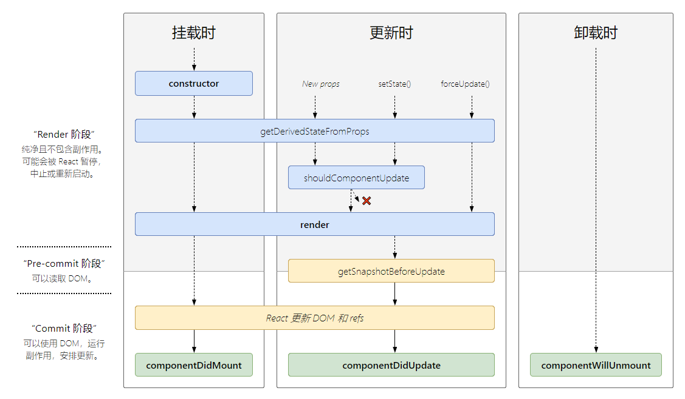

## react 基础

### JSX

- JSX是一个 JavaScript 的语法扩展,可以很好地描述 UI 应该呈现出它应有交互的本质形式。
- React DOM 在渲染所有输入内容之前，默认会进行转义。它可以确保在你的应用中，永远不会注入那些并非自己明确编写的内容。所有的内容在渲染之前都被转换成了字符串。
- JSX 里的 class 变成了 className

###### 深入了解：

JSX 仅仅只是 React.createElement(component, props, ...children) 函数的语法糖。

如下JSX代码：
```
<MyButton color="blue" shadowSize={2}>
  Click Me
</MyButton>
```
会编译为：
```
React.createElement(
  MyButton,
  {color: 'blue', shadowSize: 2},
  'Click Me'
)
```

### 元素

- 元素是构成 React 应用的最小砖块。
- React 元素是创建开销极小的普通对象。React DOM 会负责更新 DOM 来与 React 元素保持一致。
- 组件是由元素构成的。
- `false`, `null`, `undefined`, `true` 是合法的子元素。但它们并不会被渲染。

以下的 JSX 表达式渲染结果相同：
```
<div />

<div></div>

<div>{false}</div>

<div>{null}</div>

<div>{undefined}</div>

<div>{true}</div>
```

### 组件

组件名称必须以大写字母开头(React 会将以小写字母开头的组件视为原生 DOM 标签)

- 函数组件（以前称之为无状态组件，但`Hook`出来之后叫为函数组件）：
```
function Welcome(props) {
  return <h1>Hello, {props.name}</h1>;
}
```

- class组件
```
class Welcome extends React.Component {
  render() {
    return <h1>Hello, {this.props.name}</h1>;
  }
}
```

### props

当 React 元素为用户自定义组件时，它会将 JSX 所接收的属性（attributes）转换为单个对象传递给组件，这个对象被称之为 “props”。组件无论是使用函数声明还是通过 class 声明，都决不能修改自身的 props
```
// 这段代码会在页面上渲染 “Hello, Sara”
function Welcome(props) {
  return <h1>Hello, {props.name}</h1>;
}

const element = <Welcome name="Sara" />;
ReactDOM.render(
  element,
  document.getElementById('root')
);

//上段代码渲染时发生了什么：
  1. 我们调用 ReactDOM.render() 函数，并传入 <Welcome name="Sara" /> 作为参数。
  2. React 调用 Welcome 组件，并将 {name: 'Sara'} 作为 props 传入。
  3. Welcome 组件将 <h1>Hello, Sara</h1> 元素作为返回值。
  4. React DOM 将 DOM 高效地更新为 <h1>Hello, Sara</h1>。
```
有多种方式可以在 JSX 中指定 props。
  - JavaScript 表达式作为 Props
  - 字符串字面量
  - props 默认值为`true`

### State

- 使用`this.setState()`设置state的值
- `this.setState()`可能是异步的
- 调用`this.setState()`的时候，React 会把你提供的对象合并到当前的 state。

### 数据流

`react`是单向数据流，任何的 state 总是所属于特定的组件，而且从该 state 派生的任何数据或 UI 只能影响树中“低于”它们的组件。

### 生命周期

在 V16 版本中引入了 Fiber 机制。这个机制一定程度上的影响了部分生命周期的调用，并且也引入了新的 2 个 API 来解决问题。（Fiber 本质上是一个虚拟的堆栈帧，新的调度器会按照优先级自由调度这些帧，从而将之前的同步渲染改成了异步渲染，在不影响体验的情况下去分段计算更新。在之前的版本中，如果你拥有一个很复杂的复合组件，然后改动了最上层组件的 state，那么调用栈可能会很长，调用栈过长，再加上中间进行了复杂的操作，就可能导致长时间阻塞主线程，带来不好的用户体验。Fiber 就是为了解决该问题而生。）
```
class ExampleComponent extends React.Component {
  // 用于初始化 state
  constructor(props) {
    super(props)
    this.state = { hasError: false };
  }

  // 用于替换 `componentWillReceiveProps` ，该函数会在初始化和 `update` 时被调用
  // 因为该函数是静态函数，所以取不到 `this`, 如果需要对比 `prevProps` 需要单独在 `state` 中维护
  // 它应返回一个对象来更新 state
  static getDerivedStateFromProps(nextProps, prevState) {}

  // 判断是否需要更新组件，多用于组件性能优化
  shouldComponentUpdate(nextProps, nextState) {}

  // 组件挂载后调用
  // 可以在该函数中进行请求或者订阅
  componentDidMount() {}

  // 用于替换 componentWillUpdate ，该函数会在 update 后 DOM 更新前被调用
  // 用于读取最新的 DOM 数据。
  getSnapshotBeforeUpdate() {}

  // 组件即将销毁
  // 可以在此处移除订阅，定时器等等
  componentWillUnmount() {}

  // 组件销毁后调用
  componentDidUnMount() {}

  // 组件更新后调用
  componentDidUpdate() {}

  // 错误边界 - 渲染备用 UI
  // 更新 state 使下一次渲染能够显示降级后的 UI
  // 注意错误边界仅可以捕获其子组件的错误，它无法捕获其自身的错误
  static getDerivedStateFromError(error) {
    return { hasError: true };
  }

  // 错误边界 - 打印错误信息
  // 你同样可以将错误日志上报给服务器
  // 注意错误边界仅可以捕获其子组件的错误，它无法捕获其自身的错误
  componentDidCatch(error, info) {
    console.log(error, info);
  }

  // 渲染组件函数
  render() {}

  // 以下函数不建议使用
  UNSAFE_componentWillMount() {}
  UNSAFE_componentWillUpdate(nextProps, nextState) {}
  // 接收到新的props时调用
  UNSAFE_componentWillReceiveProps(nextProps) {}
}
```
对于异步渲染，现在渲染有两个阶段：reconciliation 和 commit 。前者过程是可以打断的，后者不能暂停，会一直更新界面直到完成。
- Reconciliation 阶段：
  - componentWillMount
  - componentWillUpdate
  - componentWillReceiveProps
  - shouldComponentUpdate
- Commit 阶段：
  - componentDidMount
  - componentDidUpdate
  - componentWillUnmount

因为 reconciliation 阶段是可以被打断的，所以 reconciliation 阶段会执行的生命周期函数就可能会出现调用多次的情况，从而引起 Bug。所以对于 reconciliation 阶段调用的几个函数，除了 shouldComponentUpdate 以外，其他都应该避免去使用。

#### V16.4以后生命周期图解（不包含官方不建议使用的）


### 事件处理

- React 事件的命名采用小驼峰式（camelCase），而不是纯小写。
- 使用 JSX 语法时你需要传入一个函数作为事件处理函数，而不是一个字符串。

为JSX内时间绑定this的几种方式：

- constructor内处理：
```
constructor() {
  this.handleClick = this.handleClick.bind(this);
}
```
- JSX内使用bind:
```
<button onClick={this.handleClick.bind(this, id)}>Delete Row</button>
```
- 箭头函数：
```
<button onClick={() => this.handleClick(id)}>Delete Row</button>
```

### key

key 帮助 React 识别哪些元素改变了，比如被添加或删除。因此你应当给数组中的每一个元素赋予一个确定的标识。
key 只是在兄弟节点之间必须唯一

### 受控组件

使 React 的 state 成为“唯一数据源”。渲染表单的 React 组件还控制着用户输入过程中表单发生的操作。被 React 以这种方式控制取值的表单输入元素就叫做`受控组件`。

### 非受控组件

表单数据将交由 DOM 节点来处理。使用非受控组件时如果想赋予组件一个初始值，但是不去控制后续的更新。 在这种情况下, 你可以指定一个 `defaultValue` 属性，而不是 value。

`<input type="file" />` 始终是一个非受控组件

### 进阶
[redux-adcanve](https://github.com/TigerHee/shareJS/blob/master/react/02.react-advance.md)