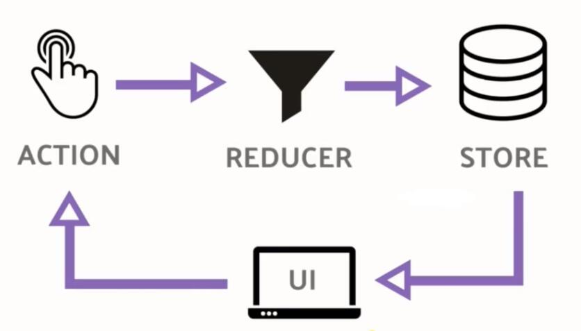

## redux

> ### 基础
  
  

  #### ***1.数据流:***
  **严格的单向数据流是 Redux 架构的设计核心。**
  **Redux 应用中数据的生命周期遵循下面 4 个步骤：**
  1. 调用 store.dispatch(action)。
      - Action 就是一个描述“发生了什么”的普通对象。
  2. Redux store 调用传入的 reducer 函数。
      - Store 会把两个参数传入 reducer： 当前的 state 树和 action。
  3. 根 reducer 应该把多个子 reducer 输出合并成一个单一的 state 树。
      - 根 reducer 的结构完全由你决定。Redux 原生提供combineReducers()辅助函数，来把根 reducer 拆分成多个函数，用于分别处理 state 树的一个分支。
  4. Redux store 保存了根 reducer 返回的完整 state 树。
      - 这个新的树就是应用的下一个 state！所有订阅 store.subscribe(listener) 的监听器都将被调用；监听器里可以调用 store.getState() 获得当前 state。
  
  ----
  #### ***2.Action:***
  **Action是把数据从应用传到 store 的有效载荷。它是 store 数据的唯一来源。**
  **一般来说你会通过 store.dispatch() 将 action 传到 store。**
  **可以把 action 理解成新闻的摘要。如 “玛丽喜欢42号文章。” 或者 “任务列表里添加了'学习 Redux 文档'”。**
  **你可以在任何地方调用 store.dispatch(action)，包括组件中、XHR 回调中、甚至定时器中。**
  
  ----
  #### ***3.Reducer:***
  **Reducers 指定了应用状态的变化如何响应 actions 并发送到 store 的，**
  **Reducers 就是一个纯函数，接收旧的 state 和 action，返回新的 state。(previousState, action) => newState**
  **永远不要在 reducer 里做这些操作：**
  1. 修改传入参数；
  1. 执行有副作用的操作，如 API 请求和路由跳转；
  1. 调用非纯函数，如 Date.now() 或 Math.random()。
  
  ----
  #### ***4.Store:***
  **Store 就是用来维持应用所有的 state 树 的一个对象。 改变 store 内 state 的惟一途径是对它 dispatch 一个 action。**
  **Store 不是类。它只是有几个方法的对象。 要创建它，只需要把根部的 reducing 函数 传递给 createStore。**
  **Store 就是把Action和Reducer联系到一起的对象。**
  - ##### Store的方法:
    - ###### getState()
        - ###### *作用：*
          返回应用当前的 state 树。它与 store 的最后一个 reducer 返回值相同。
        - ###### *返回值：*
          (any): 应用当前的 state 树。
    - ###### dispatch(action)
        - ###### *作用：*
          分发 action。这是触发 state 变化的惟一途径。会使用当前 getState() 的结果和传入的 action 以同步方式的调用 store 的 reduce 函数。返回值会被作为下一个 state。从现在开始，这就成为了 getState() 的返回值，同时变化监听器(change listener)会被触发。
        - ###### *参数：*
          action (Object)
        - ###### *返回值：*
          (Object): 要 dispatch 的 action。
        - ###### *注意：*
          使用 createStore 创建的 “纯正” store 只支持普通对象类型的 action，而且会立即传到 reducer 来执行。
          但是，如果你用 applyMiddleware 来套住 createStore 时，middleware 可以修改 action 的执行，并支持执行 dispatch intent（意图）。Intent 一般是异步操作如 Promise、Observable 或者 Thunk。
    - ###### subscribe(listener)
        - ###### *作用：*
          添加一个变化监听器。每当 dispatch action 的时候就会执行，state 树中的一部分可能已经变化。你可以在回调函数里调用 getState() 来拿到当前 state。如果需要解绑这个变化监听器，执行 subscribe 返回的函数即可。
        - ###### *参数：*
          listener (Function): 每当 dispatch action 的时候都会执行的回调。state 树中的一部分可能已经变化。你可以在回调函数里调用 getState() 来拿到当前 state。store 的 reducer 应该是纯函数，因此你可能需要对 state 树中的引用做深度比较来确定它的值是否有变化。
        - ###### *返回值：*
          (Function): 一个可以解绑变化监听器的函数。
    - ###### replaceReducer(nextReducer)
        - ###### *作用：*
          替换 store 当前用来计算 state 的 reducer。这是一个高级 API。只有在你需要实现代码分隔，而且需要立即加载一些 reducer 的时候才可能会用到它。在实现 Redux 热加载机制的时候也可能会用到。
        - ###### *参数：*
          reducer (Function) store 会使用的下一个 reducer。
> ### API
- #### ***createStore(reducer, [preloadedState], enhancer)***
  - ###### *作用：*
    创建一个 Redux store 来以存放应用中所有的 state。应用中应有且仅有一个 store。
  - ###### *参数：*
    - reducer (Function): 
    
      接收两个参数，分别是当前的 state 树和要处理的 action，返回新的state 树。
    - [preloadedState] (any):
    
       初始时的 state。 在同构应用中，你可以决定是否把服务端传来的 state 水合（hydrate）后传给它，或者从之前保存的用户会话中恢复一个传给它。如果你使用 combineReducers 创建 reducer，它必须是一个普通对象，与传入的 keys 保持同样的结构。否则，你可以自由传入任何 reducer 可理解的内容。
    - enhancer (Function):
    
      Store enhancer 是一个组合 store creator 的高阶函数，返回一个新的强化过的 store creator。这与 middleware 相似，它也允许你通过复合函数改变 store 接口。
  - ###### *返回值：*
    (Store): 保存了应用所有 state 的对象。改变 state 的惟一方法是 dispatch action。你也可以 subscribe 监听 state 的变化，然后更新 UI。

  ----
- #### ***combineReducers()***
  - ###### *作用：*
    combineReducers() 所做的只是生成一个函数，这个函数来调用你的一系列 reducer，每个 reducer 根据它们的 key 来筛选出 state 中的一部分数据并处理，然后这个生成的函数再将所有 reducer 的结果合并成一个大的对象。没有任何魔法。正如其他 reducers，如果 combineReducers() 中包含的所有 reducers 都没有更改 state，那么也就不会创建一个新的对象。

  ----
- #### ***applyMiddleware(...middlewares)***
  - ###### *作用：*
    使用包含自定义功能的 middleware 来扩展 Redux 是一种推荐的方式。Middleware 可以让你包装 store 的 dispatch 方法来达到你想要的目的。同时， middleware 还拥有“可组合”这一关键特性。多个 middleware 可以被组合到一起使用，形成 middleware 链。其中，每个 middleware 都不需要关心链中它前后的 middleware 的任何信息。
    Middleware 最常见的使用场景是无需引用大量代码或依赖类似 Rx 的第三方库实现异步 actions。这种方式可以让你像 dispatch 一般的 actions 那样 dispatch 异步 actions。

  ----
- #### ***bindActionCreators(actionCreators, dispatch)***
  - ###### *作用：*
    把一个 value 为不同 action creator 的对象，转成拥有同名 key 的对象。同时使用 dispatch 对每个 action creator 进行包装，以便可以直接调用它们。
    一般情况下你可以直接在 Store 实例上调用 dispatch。如果你在 React 中使用 Redux，react-redux 会提供 dispatch 函数让你直接调用它 。
    惟一会使用到 bindActionCreators 的场景是当你需要把 action creator 往下传到一个组件上，却不想让这个组件觉察到 Redux 的存在，而且不希望把 dispatch 或 Redux store 传给它。
    为方便起见，你也可以传入一个函数作为第一个参数，它会返回一个函数。
    另一替代 bindActionCreators 的做法是直接把 dispatch 函数当作 prop 传递给子组件，但这时你的子组件需要引入 action creator 并且感知它们

  ----
- #### ***compose(...functions)***
  - ###### *作用：*
    从右到左来组合多个函数。
    这是函数式编程中的方法，为了方便，被放到了 Redux 里。当需要把多个 store 增强器 依次执行的时候，需要用到它。

> ### react-redux

Redux 官方提供的 React 绑定库,具有高效且灵活的特性。此库并不是 Redux 内置，需要单独安装。

- #### react-redux API:

  - ##### ***`<Provider store>`***
    - ###### *作用：*
      `<Provider store>` 使组件层级中的 connect() 方法都能够获得 Redux store。正常情况下，你的根组件应该嵌套在 `<Provider>` 中才能使用 connect() 方法。
    - ###### *属性：*
      - store (Redux Store): 应用程序中唯一的 Redux store 对象
      - children (ReactElement) 组件层级的根组件。

  - ##### ***`connect([mapStateToProps], [mapDispatchToProps], [mergeProps], [options])`***
    - ###### *作用：*
      连接 React 组件与 Redux store。连接操作不会改变原来的组件类。反而返回一个新的已与 Redux store 连接的组件类。
    - ###### *参数：*
      - [mapStateToProps(state, [ownProps]): stateProps] (Function)：
        
        如果定义该参数，组件将会监听 Redux store 的变化。任何时候，只要 Redux store 发生改变，mapStateToProps 函数就会被调用。该回调函数必须返回一个纯对象，这个对象会与组件的 props 合并。如果你省略了这个参数，你的组件将不会监听 Redux store。如果指定了该回调函数中的第二个参数 ownProps，则该参数的值为传递到组件的 props，而且只要组件接收到新的 props，mapStateToProps 也会被调用（例如，当 props 接收到来自父组件一个小小的改动，那么你所使用的 ownProps 参数，mapStateToProps 都会被重新计算）。

      - [mapDispatchToProps(dispatch, [ownProps]): dispatchProps] (Object or Function)：

        如果传递的是一个函数，该函数将接收一个 dispatch 函数，然后由你来决定如何返回一个对象，这个对象通过 dispatch 函数与 action creator 以某种方式绑定在一起（提示：你也许会用到 Redux 的辅助函数 bindActionCreators()。如果你省略这个 mapDispatchToProps 参数，默认情况下，dispatch 会注入到你的组件 props 中。如果指定了该回调函数中第二个参数 ownProps，该参数的值为传递到组件的 props，而且只要组件接收到新 props，mapDispatchToProps 也会被调用。

      - [mergeProps(stateProps, dispatchProps, ownProps): props] (Function)：

        如果指定了这个参数，mapStateToProps() 与 mapDispatchToProps() 的执行结果和组件自身的 props 将传入到这个回调函数中。该回调函数返回的对象将作为 props 传递到被包装的组件中。你也许可以用这个回调函数，根据组件的 props 来筛选部分的 state 数据，或者把 props 中的某个特定变量与 action creator 绑定在一起。如果你省略这个参数，默认情况下返回 Object.assign({}, ownProps, stateProps, dispatchProps) 的结果。

      - [options] (Object)：

         如果指定这个参数，可以定制 connector 的行为。

         `[pure = true]` (Boolean):如果为 true，connector 将执行 shouldComponentUpdate 并且浅对比 mergeProps 的结果，避免不必要的更新，前提是当前组件是一个“纯”组件，它不依赖于任何的输入或 state 而只依赖于 props 和 Redux store 的 state。默认值为 true。
         
         `[withRef = false]` (Boolean): 如果为 true，connector 会保存一个对被被包含的组件实例的引用，该引用通过 getWrappedInstance() 方法获得。默认值为 false。

> ### 异步Ation
  [redux-saga](https://github.com/TigerHee/shareJS/blob/master/react/05.redux-saga.md)

> ### 示例项目:
💯[tiger-react-cli](https://github.com/TigerHee/tiger-react-cli)
