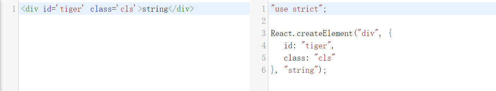

## createElement

平时我们在React组件内书写的JSX代码在编译时会被处理成如下:



此效果在 [Babel](https://babeljs.io/repl/) 上实现。

React.js内是如何引用createElement:
```
//首先引入
import {
  createElement,
  createFactory,
  cloneElement,
  isValidElement,
} from './ReactElement';

//应用
const React = {
  // ...other props
  createElement: __DEV__ ? createElementWithValidation : createElement,
  cloneElement: __DEV__ ? cloneElementWithValidation : cloneElement,
  createFactory: __DEV__ ? createFactoryWithValidation : createFactory,
};
export default React;
```

createElement代码在同级目录下 ReactElement.js 内：
```
export function createElement(type, config, children) {
  let propName;
  // Reserved names are extracted
  const props = {};
  let key = null;
  let ref = null;
  let self = null;
  let source = null;
  // 处理props
  if (config != null) {
    if (hasValidRef(config)) {
      ref = config.ref;
    }
    if (hasValidKey(config)) {
      key = '' + config.key;
    }
    self = config.__self === undefined ? null : config.__self;
    source = config.__source === undefined ? null : config.__source;
    // Remaining properties are added to a new props object
    for (propName in config) {
      if (
        hasOwnProperty.call(config, propName) &&
        !RESERVED_PROPS.hasOwnProperty(propName)
      ) {
        props[propName] = config[propName];
      }
    }
  }
  // 处理多个children
  const childrenLength = arguments.length - 2;
  if (childrenLength === 1) {
    props.children = children;
  } else if (childrenLength > 1) {
    const childArray = Array(childrenLength);
    for (let i = 0; i < childrenLength; i++) {
      childArray[i] = arguments[i + 2];
    }
    if (__DEV__) {
      if (Object.freeze) {
        Object.freeze(childArray);
      }
    }
    props.children = childArray;
  }
  // defaultProps的处理
  if (type && type.defaultProps) {
    const defaultProps = type.defaultProps;
    for (propName in defaultProps) {
      if (props[propName] === undefined) {
        props[propName] = defaultProps[propName];
      }
    }
  }
  if (__DEV__) {
    if (key || ref) {
      const displayName = typeof type === 'function' ? type.displayName || type.name || 'Unknown' : type;
      if (key) { defineKeyPropWarningGetter(props, displayName); }
      if (ref) { defineRefPropWarningGetter(props, displayName); }
    }
  }
  return ReactElement(
    type,
    key,
    ref,
    self,
    source,
    ReactCurrentOwner.current,
    props,
  );
}
```
ReactElement通过createElement创建，调用该方法需要传入三个参数：

- type (指代这个ReactElement的类型)
- config (ReactElement的属性)
- children (ReactElement的内容)

从如下代码：
```
if (
  hasOwnProperty.call(config, propName) &&
  !RESERVED_PROPS.hasOwnProperty(propName)
) {
  props[propName] = config[propName];
}
```
```
//内嵌props
const RESERVED_PROPS = {
  key: true,
  ref: true,
  __self: true,
  __source: true,
};
```
可以看出`key`,`ref`,`__self`,`__source`不会被复到元素的props上去


createElement最后返回了一个ReactElement，ReactElement会返回一个对象代码如下：

```
const ReactElement = function(type, key, ref, self, source, owner, props) {
  const element = {
    // This tag allows us to uniquely identify this as a React Element
    $$typeof: REACT_ELEMENT_TYPE,
    // Built-in properties that belong on the element
    type: type,
    key: key,
    ref: ref,
    props: props,
    // Record the component responsible for creating this element.
    _owner: owner,
  };

  if (__DEV__) {
    element._store = {};
    Object.defineProperty(element._store, 'validated', {
      configurable: false,
      enumerable: false,
      writable: true,
      value: false,
    });
    Object.defineProperty(element, '_self', {
      configurable: false,
      enumerable: false,
      writable: false,
      value: self,
    });
    Object.defineProperty(element, '_source', {
      configurable: false,
      enumerable: false,
      writable: false,
      value: source,
    });
    if (Object.freeze) {
      Object.freeze(element.props);
      Object.freeze(element);
    }
  }
  return element;
};
```
ReactElement只是一个用来承载信息的容器，他会告诉后续的操作这个节点的以下信息：
- `type`类型，用于判断如何创建节点
- `key`和`ref`这些特殊信息
- `props`新的属性内容
- `$$typeof` 用来标识element是什么类型,用于确定是否属于ReactElement
