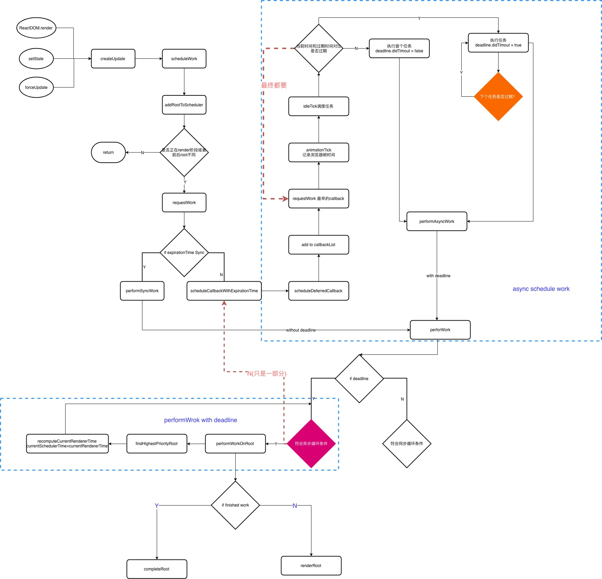

## 任务调度

任务调度图解：



源码在 react-reconciler 下的 ReactFiberScheduler.js 内：

##### scheduleWork:
```
function scheduleWork(fiber: Fiber, expirationTime: ExpirationTime) {
    // 更新Fiber及所有子树的expirationTime，
    // 返回FiberRoot
  const root = scheduleWorkToRoot(fiber, expirationTime);
  if (root === null) {
    // 去掉__DEV__代码
    return;
  }
  if (
    !isWorking &&
    nextRenderExpirationTime !== NoWork &&
    expirationTime > nextRenderExpirationTime
  ) {
    // This is an interruption. (Used for performance tracking.)
    interruptedBy = fiber;
    // 优先执行高优先级的任务
    resetStack();
  }
  markPendingPriorityLevel(root, expirationTime);
  if (
    // If we're in the render phase, we don't need to schedule this root
    // for an update, because we'll do it before we exit...
    !isWorking ||
    isCommitting ||
    // ...unless this is a different root than the one we're rendering.
    nextRoot !== root
  ) {
    const rootExpirationTime = root.expirationTime;
    requestWork(root, rootExpirationTime);
  }
  if (nestedUpdateCount > NESTED_UPDATE_LIMIT) {
    // Reset this back to zero so subsequent updates don't throw.
    // 防止更新中修改state,无限循环进入更新
    nestedUpdateCount = 0;
    invariant(
      false,
      'Maximum update depth exceeded. This can happen when a ' +
        'component repeatedly calls setState inside ' +
        'componentWillUpdate or componentDidUpdate. React limits ' +
        'the number of nested updates to prevent infinite loops.',
    );
  }
}
```

##### requestWork:

- 加入到root调度队列
- 判断是否批量更新
- 根据expirationTime判断调度类型

```
function requestWork(root: FiberRoot, expirationTime: ExpirationTime) {
  // 处理firstScheduledRoot,lastScheduledRoot,root的expirationTime
  addRootToSchedule(root, expirationTime);
  if (isRendering) {
    // 已经开始
    return;
  }
  if (isBatchingUpdates) {
    // Flush work at the end of the batch.
    if (isUnbatchingUpdates) {
      // ...unless we're inside unbatchedUpdates, in which case we should
      // flush it now.
      nextFlushedRoot = root;
      nextFlushedExpirationTime = Sync;
      performWorkOnRoot(root, Sync, false);
    }
    return;
  }
  // TODO: Get rid of Sync and use current time?
  if (expirationTime === Sync) {
    performSyncWork();
  } else {
    scheduleCallbackWithExpirationTime(root, expirationTime);
  }
}
```

setState 是同步的还是异步的？

setState本身的方法调用是同步的，但是调用setState并不标志着React的state立马就更新了，这个更新是要根据我们当前的执行环境的上文来判断的如果处于`isBatchingUpdates`环境下不会同步更新的，另还有异步更新调度也不会同步更新。

##### scheduler包（被提到与react-reconciler同级的目录）:

- 维护时间片
- 模拟requestIdleCallback(等浏览器把要做的事做完后来调取回调)
- 调度列表和超时判断

主要用到的方法：
> 1

```
function scheduleCallbackWithExpirationTime(root: FiberRoot, expirationTime: ExpirationTime,){}
```

异步进行root任务调度就是通过这个方法来做的，这里最主要的就是调用了scheduler的scheduleDeferredCallback方法（在scheduler包中是scheduleWork）

传入的的是回调函数performAsyncWork，以及一个包含timeout超时事件的对象

> 2

```
function unstable_scheduleCallback(callback, deprecated_options){}
```

创建一个调度节点newNode，并按照timoutAt的顺序加入到CallbackNode链表，调用ensureHostCallbackIsScheduled

这里面的expirationTime是调用时传入的timeoutAt加上当前时间形成的过期时间。

> 3

```
function ensureHostCallbackIsScheduled(){}
```

如果已经在调用回调了，就 return，因为本来就会继续调用下去，isExecutingCallback在flushWork的时候会被修改为true

如果isHostCallbackScheduled为false，也就是还没开始调度，那么设为true，如果已经开始了，就直接取消，因为顺序可能变了。

调用requestHostCallback开始调度

> 4

```
requestHostCallback = function(callback, absoluteTimeout){}
```

开始进入调度，设置调度的内容，用scheduledHostCallback和timeoutTime这两个全局变量记录回调函数和对应的过期时间

调用requestAnimationFrameWithTimeout，其实就是调用requestAnimationFrame在加上设置了一个100ms的定时器，防止requestAnimationFrame太久不触发。

调用回调animtionTick并设置isAnimationFrameScheduled全局变量为true

> 5

```
var animationTick = function(rafTime) {}
```

只要scheduledHostCallback还在就继续调要requestAnimationFrameWithTimeout因为这一帧渲染完了可能队列还没情况，本身也是要进入再次调用的，这边就省去了requestHostCallback在次调用的必要性

接下去一段代码是用来计算相隔的requestAnimationFrame的时差的，这个时差如果连续两次都小鱼当前的activeFrameTime，说明平台的帧率是很高的，这种情况下会动态得缩小帧时间。

最后更新frameDeadline，然后如果没有触发idleTick则发送消息

> 6

```
window.addEventListener('message', idleTick, false)

var idleTick = function(event) {}
```

首先判断postMessage是不是自己的，不是直接返回

清空scheduledHostCallback和timeoutTime

获取当前时间，对比frameDeadline，查看是否已经超时了，如果超时了，判断一下任务callback的过期时间有没有到，如果没有到，则重新对这个callback进行一次调度，然后返回。如果到了，则设置didTimeout为true

接下去就是调用callback了，这里设置isFlushingHostCallback全局变量为true代表正在执行。并且调用callback也就是flushWork并传入didTimeout

> 7

```
function flushWork(didTimeout) {}
```

先设置isExecutingCallback为true，代表正在调用callback

设置deadlineObject.didTimeout，在 React 业务中可以用来判断任务是否超时

如果didTimeout，会一次从firstCallbackNode向后一直执行，知道第一个没过期的任务

如果没有超时，则依此执行第一个callback，知道帧时间结束为止

最后清理变量，如果任务没有执行完，则再次调用ensureHostCallbackIsScheduled进入调度

顺便把Immedia优先级的任务都调用一遍。

> 8

```
 function flushFirstCallback() {}
```

如果当前队列中只有一个回调，清空队列

调用回调并传入deadline对象，里面有timeRemaining方法通过frameDeadline - now()来判断是否帧时间已经到了

如果回调有返回内容，把这个返回加入到回调队列

##### performWork:

`performWork`通过两种方式调用:

- performAsyncWork 异步方式

异步情况给performWork设置的minExpirationTime是NoWork，并且会判断dl.didTimeout，这个值是指任务的expirationTime是否已经超时，如果超时了，则直接设置newExpirationTimeToWorkOn为当前时间，表示这个任务直接执行就行了，不需要判断是否超过了帧时间

- performSyncWork 同步方式

同步方式久比较简单了，设置minExpirationTime为Sync也就是1

##### performWorkOnRoot

这里也分为同步和异步两种情况，但是这两种情况的区别其实非常小。

首先是一个参数的区别，isYieldy在同步的情况下是false，而在异步情况下是true。这个参数顾名思义就是是否可以中断，那么这个区别也就很好理解了。

第二个区别就是在renderRoot之后判断一下shouldYeild，如果时间片已经用完，则不直接completeRoot，而是等到一下次requestIdleCallback之后再执行。

`renderRoot` 和 `completeRoot` 分别对应两个阶段：

- 渲染阶段
- 提交阶段

渲染阶段可以被打断，而提交阶段不能

##### findHighestPriorityRoot

一般情况下我们的 React 应用只会有一个root，所以这里的大部分逻辑其实都不是常见情况。

循环`firstScheduledRoot => lastScheduledRoot`，`remainingExpirationTime`是`root.expirationTime`，也就是最早的过期时间。

如果他是`NoWork`说明他已经没有任务了，从链表中删除。

从剩下的中找到`expirationTime`最小的也就是优先级最高的`root`然后把他赋值给`nextFlushedRoot`并把他的`expirationTime`赋值给`nextFlushedExpirationTime`这两个公共变量。

一般来说会直接执行下面这个逻辑

```
if (root === root.nextScheduledRoot) {
  // This is the only root in the list.
  root.nextScheduledRoot = null;
  firstScheduledRoot = lastScheduledRoot = null;
  break;
}
```

##### renderRoot

首先是一个判断是否需要初始化变量的判断
```
if (
  expirationTime !== nextRenderExpirationTime ||
  root !== nextRoot ||
  nextUnitOfWork === null
) {
  // Reset the stack and start working from the root.
  resetStack()
  nextRoot = root
  nextRenderExpirationTime = expirationTime
  nextUnitOfWork = createWorkInProgress(
    nextRoot.current,
    null,
    nextRenderExpirationTime,
  )
  root.pendingCommitExpirationTime = NoWork
}
```
他判断的情况是是否有新的更新进来了。假设这种情况：上一个任务因为时间片用完了而中断了，这个时候nextUnitOfWork是有工作的，这时候如果下一个requestIdleCallback进来了，中途没有新的任务进来，那么这些全局变量都没有变过，root的nextExpirationTimeToWorkOn肯定也没有变化，那么代表是继续上一次的任务。而如果有新的更新进来，则势必nextExpirationTimeToWorkOn或者root会变化，那么肯定需要重置变量

`resetStack`如果是被中断的情况，会推出`context`栈

然后就进入整体，调用workLoop

```
function workLoop(isYieldy) {
  if (!isYieldy) {
    // Flush work without yielding
    while (nextUnitOfWork !== null) {
      nextUnitOfWork = performUnitOfWork(nextUnitOfWork)
    }
  } else {
    // Flush asynchronous work until the deadline runs out of time.
    while (nextUnitOfWork !== null && !shouldYield()) {
      nextUnitOfWork = performUnitOfWork(nextUnitOfWork)
    }
  }
}
```
workLoop逻辑很简单的，只是判断是否需要继续调用performUnitOfWork

在workLoop执行完之后，就进入收尾阶段了。

首先如果didFatal为true，代表有一个无法处理的错误，直接调用onFatal，不commit
```
function onFatal(root) {
  root.finishedWork = null
}
```

如果nextUnitOfWork !== null，代表任务没有执行完，是yield了，执行onYield

```
function onYield(root) {
  root.finishedWork = null
}
```

如果以上都没有，说明已经complete整棵树了，如果nextRenderDidError代表有捕获到可处理的错误

这时候先判断是否有优先级更低的任务，有的话把当前的渲染时间设置进suspendTime，同时调用onSuspend

如果不符合再判断是否帧时间超时，如果没有超时并且没有root.didError，并且把root.expirationTime设置为Sync，然后调用onSuspend。

需要注意的是，他们调用onSuspend最后一个参数传递的都是-1，看onSuspend的逻辑可以发现其实什么都不做。什么都不做代表着，他们不会设置root.finishedWork，那么返回到上一层的performWorkOnRoot的时候

```
finishedWork = root.finishedWork
if (finishedWork !== null) {
  if (!shouldYield()) {
    // Still time left. Commit the root.
    completeRoot(root, finishedWork, expirationTime)
  } else {
    root.finishedWork = finishedWork
  }
}
```
并不会执行completeRoot也就不会commit，会再返回到performWork找下一个root
```
function onSuspend(
  root: FiberRoot,
  finishedWork: Fiber,
  suspendedExpirationTime: ExpirationTime,
  rootExpirationTime: ExpirationTime,
  msUntilTimeout: number,
): void {
  root.expirationTime = rootExpirationTime
  if (enableSuspense && msUntilTimeout === 0 && !shouldYield()) {
    // Don't wait an additional tick. Commit the tree immediately.
    root.pendingCommitExpirationTime = suspendedExpirationTime
    root.finishedWork = finishedWork
  } else if (msUntilTimeout > 0) {
    // Wait `msUntilTimeout` milliseconds before committing.
    root.timeoutHandle = scheduleTimeout(
      onTimeout.bind(null, root, finishedWork, suspendedExpirationTime),
      msUntilTimeout,
    )
  }
}

function onTimeout(root, finishedWork, suspendedExpirationTime) {
  if (enableSuspense) {
    // The root timed out. Commit it.
    root.pendingCommitExpirationTime = suspendedExpirationTime
    root.finishedWork = finishedWork
    // Read the current time before entering the commit phase. We can be
    // certain this won't cause tearing related to batching of event updates
    // because we're at the top of a timer event.
    recomputeCurrentRendererTime()
    currentSchedulerTime = currentRendererTime

    if (enableSchedulerTracing) {
      // Don't update pending interaction counts for suspense timeouts,
      // Because we know we still need to do more work in this case.
      suspenseDidTimeout = true
      flushRoot(root, suspendedExpirationTime)
      suspenseDidTimeout = false
    } else {
      flushRoot(root, suspendedExpirationTime)
    }
  }
}
```
其中scheduleTimeout是不同平台的setTimout

最后一个判断就是真正的挂起任务了，也就是suquense的情况，其实做的事情跟上面两个差不多，唯一的区别是调用onSuspend的时候最后一个参数肯定是大于等于零的。代表着他是立刻就要commit还是在一个timeout之后再commit。因为我们可以看到onTimeout最后是flushRoot，就是以Sync的方式调用performWork

如果以上逻辑都没有，那么直接调用onComplete
```
function onComplete(
  root: FiberRoot,
  finishedWork: Fiber,
  expirationTime: ExpirationTime,
) {
  root.pendingCommitExpirationTime = expirationTime
  root.finishedWork = finishedWork
}
```