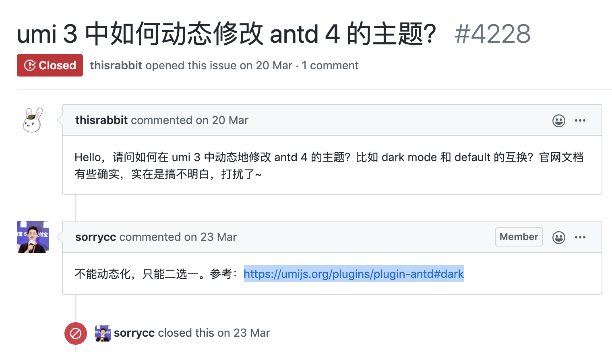
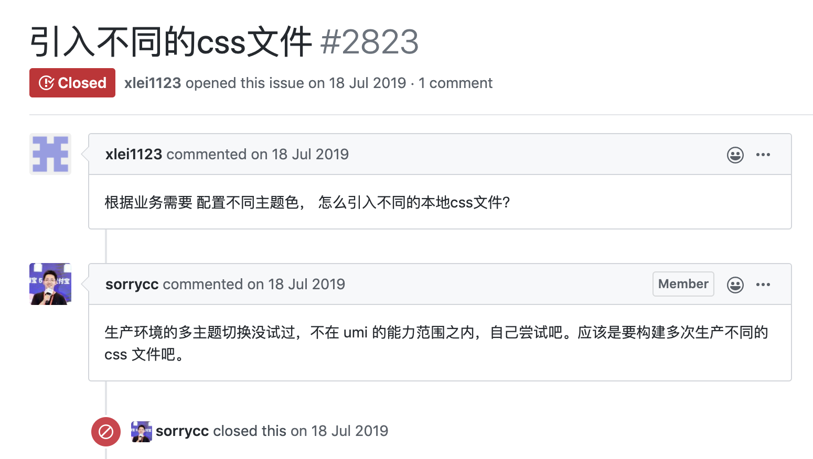
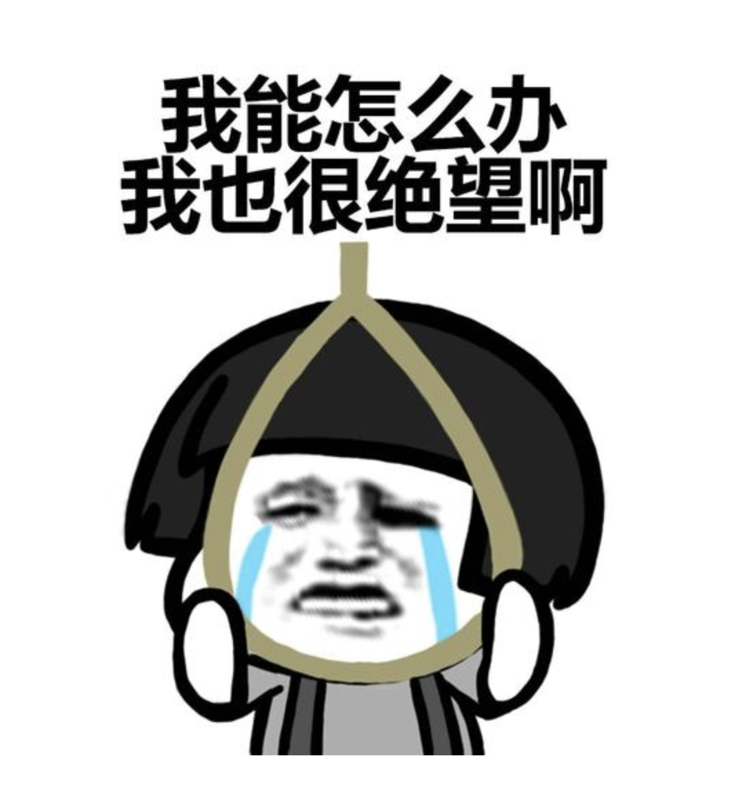
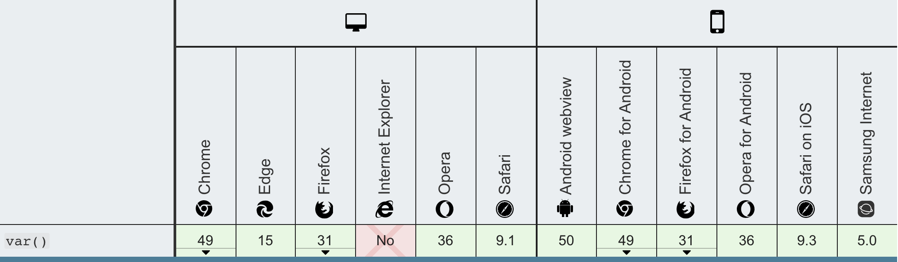

前言：
---

> 新项目设计稿评审后准备开工，老大说：考虑一下需要支持主题切换，我说：好的

开始：
---

项目框架选型：umi + Antd

算是比较成熟的套餐了，主题切换应该是小case的需求，于是：

1.  去antd Design官网看，只能定制主题，没介绍怎么支持动态切换
2.  去umi文档查看，只有设置theme参数(看起来和定制主题差不多的意思)
3.  不死心去gayhub看isuues，于是：





开始在gayhub乱逛，终于发现好东西：

[umi-plugin-antd-theme](https://link.zhihu.com/?target=https%3A//github.com/chenshuai2144/umi-plugin-antd-theme)

虽然插件应该是为[Ant Design Pro](https://link.zhihu.com/?target=https%3A//pro.ant.design/docs/dynamic-theme-cn)打造的但是Antd是一家，拿来开搞按照文档里说明的配置项目：

```text
yarn add umi-plugin-antd-theme -D
```

修改.umirc.js:

```js
plugins: [
  ...other配置，
  [
      'umi-plugin-antd-theme',
      {
        theme: [
          {
            key: 'normal',
            fileName: 'normal.css',
            modifyVars: {
              '@primary-color': '#0FCD8C',
              '@btn-primary-color': '#01081E',
            },
          },
          {
            key: 'dark',
            fileName: 'dark.css',
            modifyVars: {
              '@primary-color': '#ff6100',
              '@btn-primary-color': '#ff6100',
            },
          },
        ],
      },
    ],
],
alias:{
  theme: `${__dirname}/src/theme/`,
}

```

src目录下面新增theme目录：

1.config.less( 并在global.less中引入 ):

```css
.body-wrap-theme-normal {
  // theme1下的全局变量在此定义
  --font-color: #000000;
  --bg-color: #011313;
}

.body-wrap-theme-dark {
  // theme2下的全局变量在此定义
  --font-color: #ffffff;
  --bg-color: #ffffff;
}
```

2.index.less( react组件的样式文件内引入此变量文件即可使用less变量 ):

```less
@color: var(--font-color);
@background: var(--bg-color);
```

3.设置切换主题的方法：

```js
export const setTheme = (theme = 'normal') => {
  console.log('== setTheme ==', theme)
  let styleLink = document.getElementById('theme-style');
  let body = document.querySelector('body');
  let hrefSrc = '/theme/normal.css';
  let bodyClsName = 'body-wrap-theme-normal';

  if (theme === 'normal') {
    hrefSrc = '/theme/normal.css';
    bodyClsName = 'body-wrap-theme-normal';
  } else if (theme === 'dark') {
    hrefSrc = '/theme/dark.css';
    bodyClsName = 'body-wrap-theme-dark';
  }

  if (styleLink) {
    styleLink.href = hrefSrc;
    body.className = bodyClsName;
  } else {
    styleLink = document.createElement('link');
    styleLink.type = 'text/css';
    styleLink.rel = 'stylesheet';
    styleLink.id = 'theme-style';
    styleLink.href = hrefSrc;
    body.className = bodyClsName;
    document.body.append(styleLink);
  }
}

```

然后把项目跑起来在chrome里调试调用setTheme, 嗯～～达到了想要的效果, 但是要兼容ie10，去查查css变量的兼容性，一首凉凉：



_还能怎么办，处理兼容咯，2333333333333_

**找找大佬们的插件：**

1.  [postcss-custom-properties](https://link.zhihu.com/?target=https%3A//github.com/postcss/postcss-custom-properties)

尝试后发现只能处理设置在 :root{} 下面的css变量并且不能动态变更，告辞！

2.[postcss-css-variables](https://link.zhihu.com/?target=https%3A//github.com/MadLittleMods/postcss-css-variables)

看到作者在README里面diss了插件1只能处理:root，燃起信心拿来试试，结果此插件不能做到智能地处理DOM结构嵌套的场景.

_只能处理：_

```less
.a{
  --color: #fff;
  .b{
    color: var(--color)
  }
}
```

_而不能处理：_

```less
.a{
  --color: #fff; 
}
.b{
  color: var(--color)
}
```

3.最后找到救星[css-vars-ponyfill](https://link.zhihu.com/?target=https%3A//github.com/jhildenbiddle/css-vars-ponyfill)支持动态处理：

在上面theme目录下新增index.js, 并且删除config.less及其引用:

```js
import cssVars from 'css-vars-ponyfill';

export const THEME = {
  normal: {
    '--font-color': '#000',
    '--bg-color': '#000',
  },
  dark: {
    '--font-color': '#fff',
    '--bg-color': '#fff',
  },
};

export const setTheme = themeKey => {
  const themeKeys = Object.keys(THEME);
  let KEY = null;
  if (themeKeys.includes(themeKey)) {
    KEY = themeKey;
  } else {
    KEY = localStorage.theme || 'normal';
  }
  localStorage.theme = KEY;

  let styleLink = document.getElementById('theme-style');
  let hrefSrc = '/theme/normal.css';
  if (KEY === 'normal') {
    hrefSrc = '/theme/normal.css';
  } else if (KEY === 'dark') {
    hrefSrc = '/theme/dark.css';
  }

  if (styleLink) {
    styleLink.href = hrefSrc;
  } else {
    styleLink = document.createElement('link');
    styleLink.type = 'text/css';
    styleLink.rel = 'stylesheet';
    styleLink.id = 'theme-style';
    styleLink.href = hrefSrc;
    document.body.append(styleLink);
  }
  cssVars({
    onlyLegacy: false,
    variables: THEME[KEY],
  });
};

```

并在合适的地方调用setTheme(), 完美！！！