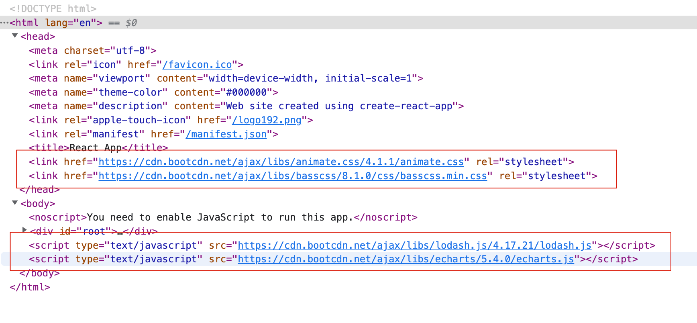

## 使用HtmlWebpackPlugin向html内插入第三方cdn资源

以往我们需要向页面内插入csn资源通常是自己写函数，然后在index.js内调用如：

  ```js
  export const insertJs = () => {
    const scriptEl = document.createElement('script');
    scriptEl.type = 'text/javascript';
    scriptEl.async = true;
    scriptEl.src = 'xx.xxx.js';
    scriptEl.onload = () => {};

    document.body.appendChild(scriptEl);
  };
  // 然后在入口js文件内调用 insertJs
  ```

而使用 HtmlWebpackPlugin 则会使资源插入更加优雅:

本文使用create-react-app与@craco/craco实现

### 第一步：修改webpack配置

craco.config.js:

```js
const { getPlugin, pluginByName } = require('@craco/craco');

module.exports = {
  webpack: {
    configure: (webpackConfig, { paths }) => {
      const { isFound: _isFound, match: _match } = getPlugin(
        webpackConfig,
        pluginByName('HtmlWebpackPlugin'),
      );

      if (_isFound) {
        _match.userOptions.cdnCss = [
          'https://cdn.bootcdn.net/ajax/libs/animate.css/4.1.1/animate.css',
          'https://cdn.bootcdn.net/ajax/libs/basscss/8.1.0/css/basscss.min.css',
        ];
        _match.userOptions.cdnJs = [
          'https://cdn.bootcdn.net/ajax/libs/lodash.js/4.17.21/lodash.js',
          'https://cdn.bootcdn.net/ajax/libs/echarts/5.4.0/echarts.js',
        ];
      }

      return webpackConfig;
    },
  },
};

```

### 第二步：修改html模版

index.html
```html
<!DOCTYPE html>
<html lang="en">
  <head>
    <% htmlWebpackPlugin.options.cdnCss.forEach(path=> { %>
      <link href="<%= path %>" rel="stylesheet">
    <% }) %>
  </head>
  <body>
    <% htmlWebpackPlugin.options.cdnJs.forEach(cdnURL=> { %>
      <script type="text/javascript" src="<%= cdnURL %>"></script>
    <% }) %>
  </body>
</html>
```

### 效果：


- Date: 2022/12/08